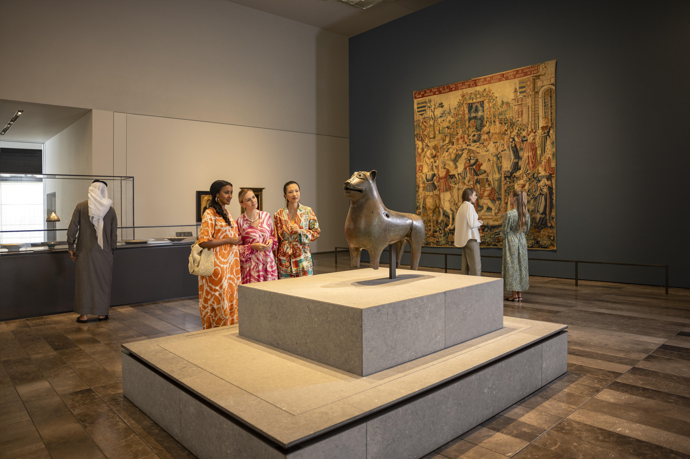
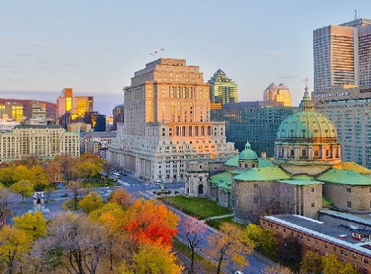
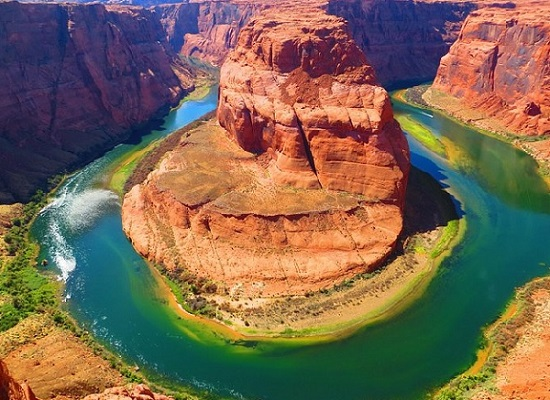
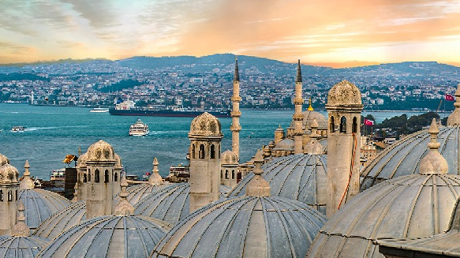
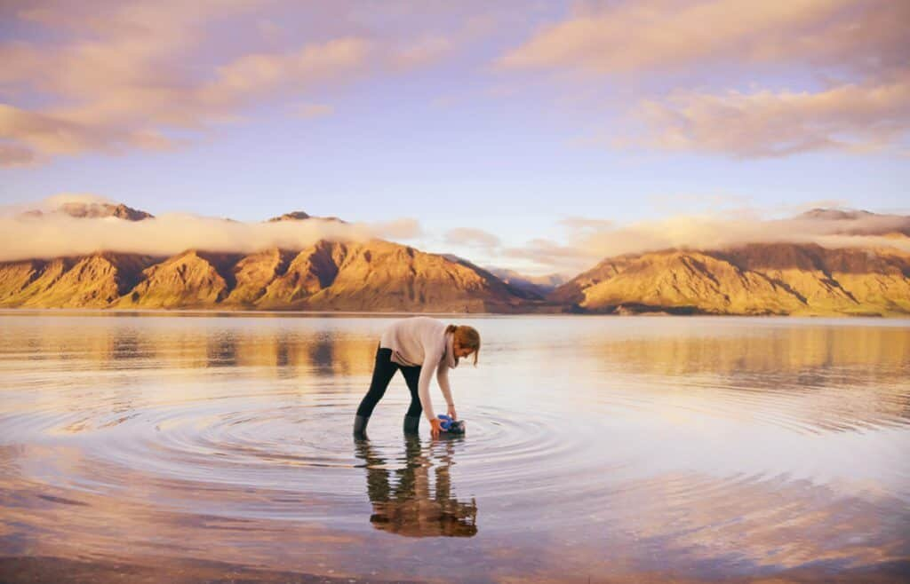

@@ -0,0 +1,249 @@
<!DOCTYPE html>
<html lang="en">
    <head>
        <title>bootstrap</title>

    <meta charset="utf-8">
    <meta name="viewport" content="width=device-width, initial-scale=1">
    <link href="https://cdn.jsdelivr.net/npm/bootstrap@5.0.2/dist/css/bootstrap.min.css" rel="stylesheet" integrity="sha384-EVSTQN3/azprG1Anm3QDgpJLIm9Nao0Yz1ztcQTwFspd3yD65VohhpuuCOmLASjC" crossorigin="anonymous">
    
<link rel="stylesheet" href="index.css">
</head>
<body>
    <nav class="navbar navbar-expand-sm bg-dark navbar-bg-dark">
    

        <a class="navbar-brand  nav justify-content-start text-white" href="#">
            &nbsp;The Great OutDoors
        </a>
        <ul class="nav nav-tabs nav-bg-dark text-white" role="tablist"  >
            <li class="nav-item nav-item-center">
            <a class="nav-link" data-bs-toggle="tab" href="#home">Home</a></li>
            <li class="nav-item">
            <a class="nav-link" data-bs-toggle="tab" href="#about">About</a></li>
            <li class="nav-item">
            <a class="nav-link"  data-bs-toggle="tab" href="#Tour">Tour</a></li>  
            <li class="nav-item">
            <a class="nav-link" data-bs-toggle="tab" href="#Packages">Packages</a></li>  
            <li class="nav-item">
            <a class="nav-link"  data-bs-toggle="tab" href="#Contact">Contact</a></li>   
            <li class="nav-item dropdown">
                <a class="nav-link dropdown-toggle" data-bs-toggle="dropdown">Blogs</a>
                 <ul class="dropdown-menu">
                    <li><a class="dropdown-item" data-bs-toggle="tab" href="#Tour">Tour</a></li>
                    <li><a class="dropdown-item"  data-bs-toggle="tab" href="#packages">packages</a></li>
                    <li><a class="dropdown-item" data-bs-toggle="tab" href="#contact">contact</a></li>
                 </ul></li>
            <button type="button" class="btn btn-primary">Book now</button>
            </ul>
        </nav>

        

        
 
         

            

                
                <h4 class="card-title">Must-do experiences in Abu Dhabi</h4>
                

                Treat yourself to a once-in-a-lifetime holiday
                experience and stay at one of Abu Dhabi's most luxurious hotels.
                Choose from vibrant private island retreats, majestic desert escapes
                and exciting glamping experiences.
 
            

            &nbsp;&nbsp;
             

                
                <h4 class="card-title">Paris
                    Capital of France</h4>
                    
Paris, France's capital, is a major 
                European city and a
                 global center for art, fashion, gastronomy and culture. Its 19th-century
                cityscape is crisscrossed by wide boulevards and the River Seine. 
                     Beyond such landmarks as the Eiffel Tower and the 12th-century.
 

             
&nbsp;&nbsp;
             

                
                <h4 class="card-title">
                    ManaliTown in Himachal Pradesh</h4>
                    
Manali is a high-altitude Himalayan resort town 
                        in India’s northern Himachal Pradesh state. It has a reputation as a 
                        backpacking center and honeymoon destination. Set on the Beas River, it’s 
                        a gateway for skiing in the Solang Valley and trekking in Parvati Valley.
 
            
&nbsp;
            

                
                <h4 class="card-title">
                    Montreal, Canada </h4>
                    
This is the best place in the entire nation of 
                        Canada with tourists flooding the area. The city is majestic with
                         a French tone to it. The historic area is filled with quaint shops
                          and cafés which is why this city gives an experience of Europe in 
                          North America. One must always visit the Notre Dame Basilica when here. 
                        
 
            
&nbsp;
            

                
                <h4 class="card-title">
                    Arizona, The Grand Canyon:</h4>
                    
This place is a natural wonder situated 
                        in Arizona state of the United States of America. It is one 
                        of the most beautiful places on the entire planet. 
                        The place's geology has been formed over the past two billion 
                        years and it is 277 miles long canyon itself. It was formed 
                        by River Colorado which still flows through it.        

                        
 &nbsp;&nbsp;
            

            

                
                <h4 class="card-title">
                    Turkey</h4>
                    

             This country is situated on Asia and Europe border
            and Istanbul is its capital city. This country
            is a great mix of culture, food and ancient monuments.
             It has a rich cultural history and significance.
            It is an Islamic country with a secular government, 
            so it's a good place for Western tourists to experience Islamic culture. This country is a mix of the new and old altogether.  
           
&nbsp;&nbsp;           
            

                

            

          

            

          

        

            

                <button type="button"  data-bs-target="#sample" data-bs-slide-to="0" class="active"></button>
                <button type="button"  data-bs-target="#sample" data-bs-slide-to="1"></button>
                <button type="button"  data-bs-target="#sample" data-bs-slide-to="2"></button>
            

            

                

                    
                    

                        <h3>EXPLORE DISCOVER TRAVEL</h3>
                    

                    

                        <h1>Adventure.....</h1>
                    

                

                

                    
                    

                        <h5>
                            “When life gives you mountains, put on your boots and hike.” — ... 
                            “The mountains whisper for me to wander; my soul hikes to the call.” — ... 
                            “Today is your day! ...
                        </h5>
                    

                

                

                    
                    

                        <h1>Explore the Beauty of  
                            the Beautiful World</h1>
                             
                        <button type="button1" class="btn btn-outline-primary btn-rounded-corners">Explore!</button>
                    

                

            

            <button class="carousel-control-prev" type="button" data-bs-target="#sample" data-bs-slide="prev">
                
            </button>
            <button class="carousel-control-next" type="button" data-bs-target="#sample" data-bs-slide="next">
                
            </button>
        

    

     

    

    

        

        

            
            <h3 class="card-title justify-content-center">Dubai  
            4 days trip 30,000</h3>
            <button type="button" class="btn btn-outline-success">Book this tour</button>
        
&nbsp;&nbsp;&nbsp;&nbsp;
         
        

            
            <h3 class="card-title justify-content-center">Paris  
            3 days trip 1,00,000</h3>
            <button type="button" class="btn btn-outline-success">Book this tour</button>
    
&nbsp;&nbsp;&nbsp;&nbsp;
     
    

        
        <h3 class="card-title justify-content-center">Manali  
        5 days trip 80,000</h3>
        <button type="button" class="btn btn-outline-success">Book this tour</button>

&nbsp;&nbsp;&nbsp;&nbsp;
 

    
    <h3 class="card-title justify-content-center">Montreal Canada  
    1 week trip 3,00,000</h3>
    <button type="button" class="btn btn-outline-success">Book this tour</button>

&nbsp;&nbsp;&nbsp;&nbsp;
 

    
    <h3 class="card-title justify-content-center">Turkey  
    3 days trip 1,00,000</h3>
    <button type="button" class="btn btn-outline-success">Book this tour</button>

&nbsp;&nbsp;&nbsp;&nbsp;
 

    
    <h3 class="card-title justify-content-center">Ariyzona Canyon 
    3 days trip 1,00,000</h3>
    <button type="button" class="btn btn-outline-success">Book this tour</button>

&nbsp;&nbsp;&nbsp;&nbsp;
 

 
 

    

        

        <h5 class="justify-content-center">  Contact us</h5>
        
Responsibility 
            Google.org 
            Sustainability 
            Crisis Response 
            Diversity & Inclusion 
            Accessibility 
            Transparency 
            Digital Wellbeing 
            Safety Centre 
            Human Rights

    

    

        
More about us 
            Contact us 
            Investor relations 
            Careers 
            Locations 
            Blog 
            Think with Google

    

    

        
Policy
            Application security 
            Software principles 
            Unwanted software policy 
            Responsible supply chain 
            Extended workforce 
            Community guidelines 
            How our business works

    

</body>
</html>
